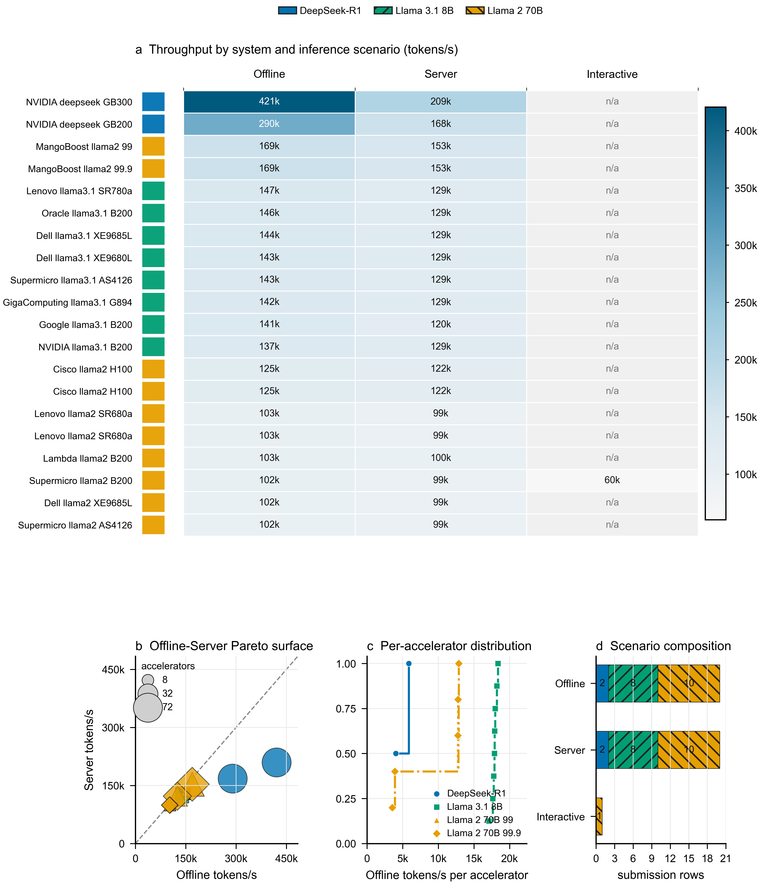
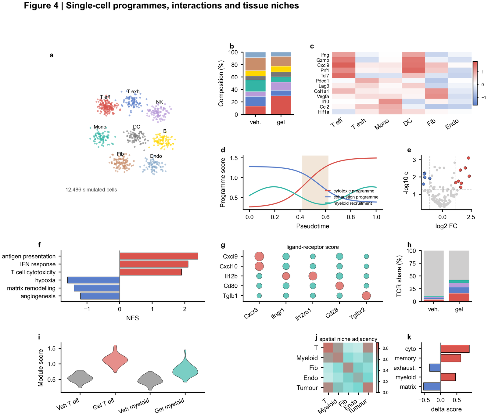
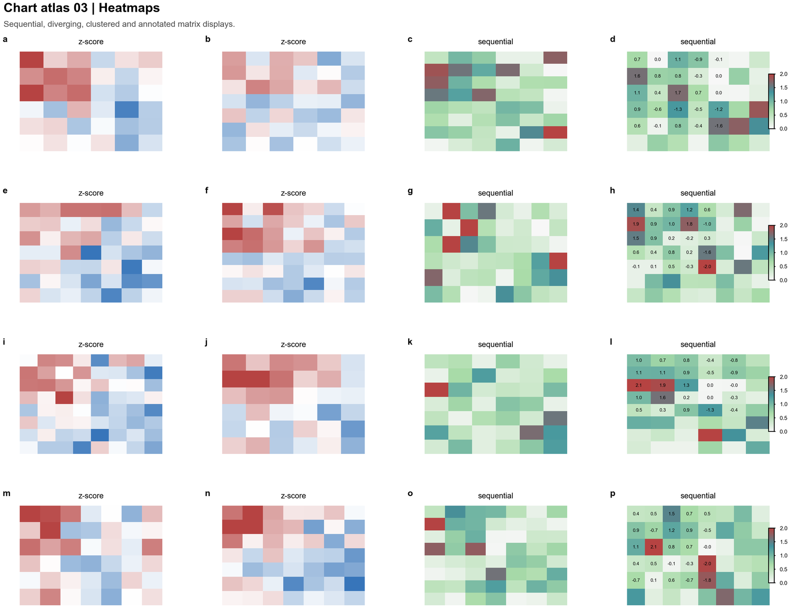
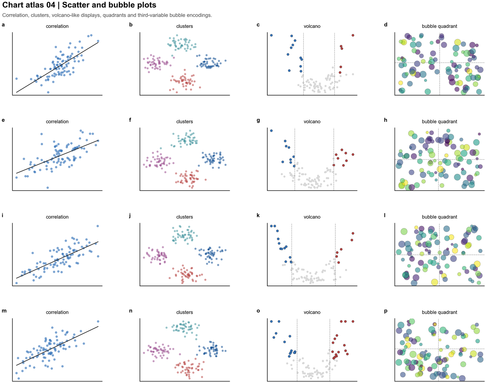

# ccfa-skills

这个仓库目前维护一个 Codex skill：`ccfa-paper-figures`。

它面向 CCF-A 和顶级计算机会议论文图，重点支持 AI、系统、网安、软工、PL、体系结构和网络方向的数据图、密集 benchmark 图，以及需要时使用的架构类复合图。

## 最新可运行示例

当前最新 showcase 是 `fig4-single-cell-systems-style`。它使用经过审计的公开 MLCommons Inference v5.1 summary 数据，生成一张高信息密度的多面板 benchmark landscape。



这张图同时测试了 skill 里最容易翻车的几件事：大热力图、底部多个 support panels、图例、色条、面板标题、密集行标签和最终导出审计。当前导出的 SVG、PDF、PNG 都已经通过审计，SVG 没有检测到明显文字重叠。

可查看这些文件：

- SVG 矢量图：`figures/fig4-single-cell-systems-style/exports/fig4_single_cell_systems_style.svg`
- PDF 论文图：`figures/fig4-single-cell-systems-style/exports/fig4_single_cell_systems_style.pdf`
- PNG 预览图：`figures/fig4-single-cell-systems-style/exports/fig4_single_cell_systems_style.png`
- 示例数据：`figures/fig4-single-cell-systems-style/data/mlcommons_inference_v5_1_public_summary_audited.csv`
- 绘图源码：`figures/fig4-single-cell-systems-style/source/plot_fig4_single_cell_systems_style.py`
- 审计结果：`figures/fig4-single-cell-systems-style/exports/figure_audit.txt`

## 图类参考

`ccfa-paper-figures` 会优先服务数据图。数据足够丰富时，它会自动选择更有视觉冲击力但不虚构信息的图类。



上图是迁移自 nature-style gallery 的风格参考，用来提示“一个 dominant panel 加多个 support panels”的版式方向。实际论文图仍必须来自用户提供、公开审计通过或许可明确的数据。

下面是当前库存里的 chart atlas 示例，用来帮助 agent 判断输入数据更适合哪种表达方式。





## 使用方式

在 Codex 新建 agent 后，直接选择或点名 `$ccfa-paper-figures`。如果只有一份数据和一个模糊风格目标，可以让 skill 先判断数据结构，再自动选择最适合的高信息密度图类。

典型提示词：

```text
Use $ccfa-paper-figures.

我给你一份 CSV 数据。目标会议是 OSDI，领域是 AI systems，风格希望偏 showpiece，但必须忠实于数据。

请先 profile 数据，自动选择最丰富但不冗余的 CCF-A 论文图类型。如果数据支持，优先生成 multi-panel benchmark landscape。不要让我在 heatmap、scatter、CDF 之间手动选择，除非数据太稀疏或关键字段不清楚。

要求：
- 只使用我提供的数据，不要 invent 数字、系统名或 benchmark 标签。
- 生成 PDF、SVG、PNG。
- 保留可复现源码和数据文件。
- 运行 figure audit。
- 修复所有文字重叠、字号过小、图例遮挡、色条标签碰撞和裁切问题后，才说完成。
- 如果多面板标题或 panel letter 太挤，把 panel letter 合并进左对齐标题。
- 如果 ECDF 或 scatter 的直接标注太密，改用紧凑图例。

CSV:
[在这里粘贴数据，或给出本地 CSV 路径]
```

也可以先让脚本只给出图类建议：

```text
python ccfa-paper-figures/scripts/suggest_showpiece.py figures/fig4-single-cell-systems-style/data/mlcommons_inference_v5_1_public_summary_audited.csv --venue OSDI --domain "AI systems" --style showpiece
```

脚本会输出推荐图类、panel plan 和一段可直接交给新 agent 的 self-prompt。

## 现在会自动考虑的小问题

最近一次优化已经把 showcase 图里暴露出的细节写回 skill：

- SVG 中最小可见文字不能低于 6 pt/px。
- 多面板很挤时，panel letter 可以合并进标题，避免漂浮字母撞标题。
- ECDF、scatter 直接标注如果太近，要改用紧凑图例。
- 色条单位如果和刻度碰撞，要移到 panel title 或 caption。
- 热力图行标签太密时，优先缩短标签、增高画布或减少显示项，而不是无限缩小字号。
- Windows 下保存审计日志时使用 UTF-8，保证 GitHub 上能直接阅读。

## 当前能力

`ccfa-paper-figures` 目前覆盖：

- CCF-A 和顶级 CS 会议的 venue-aware 数据图。
- 对比实验、消融、CDF、热力图、Pareto、分布、堆叠、雷达、qualitative grid 等常见论文图。
- 数据充足时自动选择更有视觉冲击力的 showpiece 图类。
- 架构图、系统图、威胁边界图、SE pipeline 等 schematic-led composite，但默认仍优先服务数据图。
- PDF、SVG、PNG 导出，以及文字重叠、矢量格式、图像尺寸等基础审计。

## 素材和审计

仓库里的公开素材、示例数据和参考来源必须先记录审计结论。没有通过审计的公开素材不能作为可复用库存。

主要记录文件：

- `ccfa-paper-figures/references/public-material-audit.md`
- `ccfa-paper-figures/references/source-audit.md`
- `ccfa-paper-figures/references/extension-gates.md`

主 skill 文件：

- `ccfa-paper-figures/SKILL.md`

## 未来待办

- 增强密集多面板论文图的美学设计能力。
- 增强架构图、系统图、流程图一类的实现效果。
- 持续扩展经过严格审计、可合法复用的高质量素材库。
